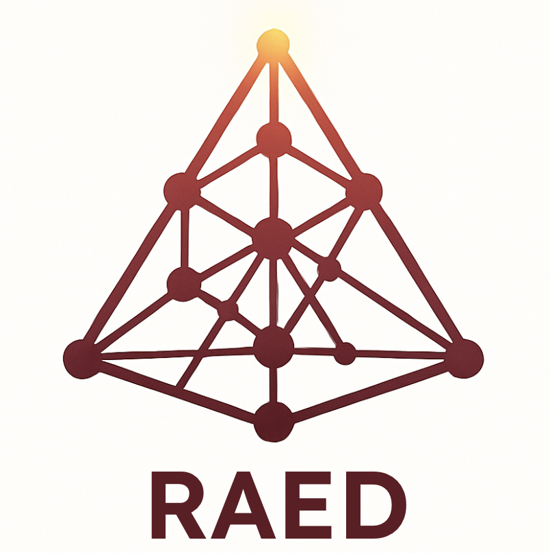

<div align="center">



# RAED: Retrieval-Augmented Entity Description Generation for Emerging Entity Linking and Disambiguation

[](https://www.python.org/)
[](https://pytorch.org/)
[](https://lightning.ai/)
[](https://huggingface.co/transformers/)
[](LICENSE)
[](https://github.com/psf/black)

**A PyTorch Lightning framework for generating entity descriptions using retrieval-augmented generation**

[Installation](#-installation) •
[Quick Start](#-usage) •
[Models](#-models) •
[Documentation](#-configuration)


</div>

---

## 🔥 News

- **[2025-10-28]** "RAED: Retrieval-Augmented Entity Description Generation for Emerging Entity Linking and Disambiguation" accepted at EMNLP 2025!
- **[2025-10-28]** Released RAED models for Emerging Entity Description Generation 

---

## 📖 Overview

RAED combines language models with a retrieval module to generate facutally accurate entity descriptions. RAED retrieves relevant context passages from Wikipedia and uses them to ground its generated output, improving performance on the entity description generation task.

### ✨ Key Features

- 🤖 **Multiple Model Support**: T5, FiD (Fusion-in-Decoder), SmolLM2, and Llama-3.2
- 🔎 **Retrieval-Augmented Generation**: Integrates retrieved contexts to improve entity description quality
- 🎯 **Entity Disambiguation and Emerging Entity Linking Evaluation**: Tested on AIDA and Tempel datasets
- ⚙️ **Flexible Training Modes**: Support for both encoder-decoder and decoder-only models
- ⚡ **PyTorch Lightning**: Easily extendible pipeline

## Table of Contents

- [Installation](#installation)
- [Project Structure](#project-structure)
- [Usage](#usage)
- [Configuration](#configuration)
- [Data Preparation](#data-preparation)
- [Evaluation](#evaluation)
- [Models](#models)
- [Citation](#cication)
- [Contributing](#contributing)
- [License](#license)
- [Citation](#citation)
- [Acknowledgments](#acknowledgments)


## 🚀 Installation

### 📋 Prerequisites

- Python 3.10+
- CUDA 11.7+ (for GPU support)
- Conda (recommended)

### ⚡ Setup

1. Clone the repository:
```bash
git clone <repository-url>
cd RAED
```

2. Run the setup script:
```bash
bash scripts/setup.sh
```

This will:
- Create a conda environment
- Install PyTorch with CUDA support
- Install all required dependencies

### 🛠️ Manual Installation

```bash
conda create -n raed python=3.10
conda activate raed
conda install pytorch torchvision cudatoolkit=11.7 -c pytorch
pip install -r requirements.txt
```

## 📁 Project Structure

```
RAED/
├── conf/                       # Hydra configuration files
│   ├── data/                   # Dataset configurations
│   ├── model/                  # Model configurations
│   ├── train/                  # Training configurations
│   └── logging/                # Logging configurations
├── src/
│   ├── data/                   # Dataset classes and utilities
│   ├── models/                 # Model implementations
│   ├── callbacks/              # Training callbacks
│   ├── trainer/                # Training, testing, and prediction scripts
│   └── Retriever/              # Retrieval system components
├── scripts/                    # Utility scripts
└── requirements.txt
```

## 🎮 Usage

### 🏋️ Training

Train a model using the default configuration:

```bash
bash scripts/train.sh
```

Or with custom configuration:

```bash
PYTHONPATH='.' python src/trainer/train.py \
    model=emerge_T5 \
    data=Aida_RAG \
    logging.wandb_arg.name=my_experiment
```

### 🧪 Testing

Evaluate a trained model:

```bash
bash scripts/test.sh
```

Or specify a checkpoint:

```bash
PYTHONPATH='.' python src/trainer/test.py \
    train.best_rag_ckpt_path=path/to/checkpoint.ckpt
```

### 🔮 Prediction

Generate predictions on a dataset:

```bash
bash scripts/predict.sh
```

## ⚙️ Configuration

RAED uses [Hydra](https://hydra.cc/) for configuration management. Configuration files are located in the `conf/` directory.

### 📝 Key Configuration Files

- `conf/raed.yaml`: Main configuration file
- `conf/model/emerge_T5.yaml`: T5 model configuration
- `conf/model/emerge_smollm2.yaml`: SmolLM2 configuration
- `conf/data/Aida_RAG.yaml`: AIDA dataset with retrieval
- `conf/train/rag_trainer.yaml`: Training hyperparameters

### Configuration Options

#### Model Selection

```yaml
model:
  model_name: 't5-large'  # or 'HuggingFaceTB/SmolLM2-360M'
  fid: False              # Enable Fusion-in-Decoder
```

#### Data Configuration

```yaml
data:
  batch_size: 8
  train_extra_contexts: 10  # Number of retrieved contexts
  test_extra_contexts: 10
  target: 'title_def'       # 'title', 'definition', or 'title_def'
```

#### Training Parameters

```yaml
train:
  seed: 42
  lr_scheduler:
    lr: 2e-05
    num_warmup_steps: 2000
  generation_params:
    num_beams: 3
    max_new_tokens: 200
```

## 📊 Data Preparation

### 🔍 Retrieval Index Creation

1. Create windows from Wikipedia pages:
```bash
python src/Retriever/windowization/create_windows.py \
    <index_file> \
    <wiki_pages> \
    <output_file>
```

2. Filter and rank contexts by similarity:
```bash
python src/Retriever/windowization/filter_cosine.py
```

3. Build the retrieval index:
```bash
python src/Retriever/retriever/create_index.py \
    --question-encoder-name-or-path <encoder> \
    --document-path <documents.jsonl> \
    --output-folder <output_dir>
```

4. Retrieve contexts for your dataset:
```bash
bash scripts/retrieve_contexts.sh
```

### 📄 Data Format

Input data should be in JSONL format with the following structure:

```json
{
  "id": "sample_id",
  "context": "Text with entity mention [DEF] entity [/DEF]",
  "wikipedia": "Entity_Title",
  "gold_definition_wikipedia": "Entity description",
  "candidates_WIKIPEDIA": [
    {"title": "Candidate_1", "text": "Description 1"},
    {"title": "Candidate_2", "text": "Description 2"}
  ],
  "candidates_RETRIEVER": [
    {"text": "Retrieved context 1"},
    {"text": "Retrieved context 2"}
  ]
}
```

## 📈 Evaluation

The system supports multiple evaluation modes:

1. **Standard Generation**: Generate entity descriptions
2. **Perplexity-based Ranking**: Rank candidates by perplexity
3. **Constrained Generation**: Generate with constrained vocabulary

Results are logged to:
- WandB (if configured)
- Local files (JSONL format)
- Console output

### 🔔 Callbacks

RAED includes several custom callbacks for evaluation:

- `EvalCallback`: Standard BLEU evaluation
- `PerplexCallback`: Perplexity-based candidate ranking
- `ConstrainedPerplexCallback`: Constrained generation
- `PredictCallback`: Save predictions to file

### 📊 Metrics

- NLG metrics (BLEU, Rouge, Semantic Similarity, BERTScore)
- Factuality metric (Factual-NLI)
- inKB F1-score (Entity Disambiguation)
- Accuracy@64 (Emerging Entity Linking)

## 🤖 Models

### 🏗️ Supported Architectures

1. **T5**: Text-to-Text Transfer Transformer
   - `t5-large`
   - `google/flan-t5-large`

2. **FiD**: Fusion-in-Decoder
   - T5-based architecture for multi-document retrieval

3. **SmolLM2**: Small language model for efficient generation
   - `HuggingFaceTB/SmolLM2-360M`

4. **Llama-3.2**: 
   - `meta-llama/Llama-3.2-1B`

### RAED for Emerging Entity Description Generation
- [🤗 RAED-passage-index ](https://huggingface.co/sapienzanlp/RAED-passage-index-wikipedia)
- [🤗 RAED-retriever](https://huggingface.co/sapienzanlp/RAED-retriever-e5-base-v2-wikipedia)
- [🤗 RAED-t5-large](https://huggingface.co/sapienzanlp/RAED-t5-large)


## 🤝 Contributing

Contributions are welcome! Please:

1. Fork the repository
2. Create a feature branch
3. Make your changes
4. Submit a pull request

## 📜 License

This work is licensed under a [Creative Commons Attribution-NonCommercial-ShareAlike 4.0 International License](http://creativecommons.org/licenses/by-nc-sa/4.0/).

[](http://creativecommons.org/licenses/by-nc-sa/4.0/)

## 📚 Citation

If you use this code in your research, please cite:

```bibtex
@inproceedings{ghonim2025raed,
  title={RAED: Retrieval-Augmented Entity Description Generation for Emerging Entity Linking and Disambiguation},
  author={Karim Ghonim, Pere-Lluís Huguet Cabot, Riccardo Orlando, Roberto Navigli},
  year={2025}
}
```

## Acknowledgments

- This work was conducted at the **Sapienza NLP Group**.

- We gratefully acknowledge the CREATIVE project (CRoss-modal understanding and gEnerATIon of Visual and tExtual content), which is funded by the MUR Progetti di Ricerca di Rilevante Interesse Nazionale programme (PRIN 2020)
- We also gratefully acknowledge the support of the PNRR MUR project PE0000013-FAIR.


## 📧 Contact

For questions or issues, please open an issue on GitHub or contact [ghonim@diag.uniroma1.it].
